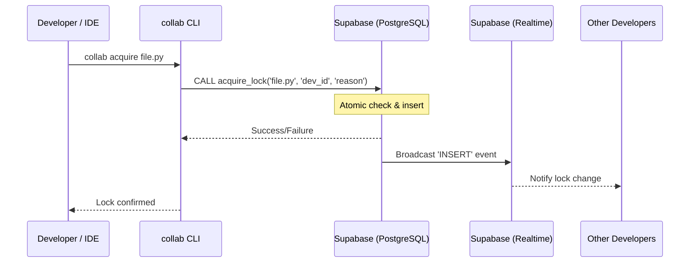

# Collab Runtime Architecture

This document describes the high-level design, component interactions, and data flow of the Collab Runtime system.

---

## System Overview

Collab Runtime is a distributed file-locking system designed for collaborative development environments. It ensures that only one developer can modify a specific file at a time, preventing merge conflicts and data loss.

### Key Components

1.  **CLI (Command Line Interface)**: The user-facing tool for manual lock operations and management.
2.  **Daemon (Watcher)**: A background process that monitors file system events and synchronizes lock state.
3.  **Supabase Backend**: Provides real-time data synchronization via PostgreSQL and Realtime (WebSockets).
4.  **VS Code Extension**: A thin client that provides UI-level integration, warnings, and status indicators.

---

## Data Flow

### 1. Lock Acquisition

### 2. Watcher Loop

The daemon runs an asynchronous loop that performs the following tasks:

- **Heartbeat**: Periodically updates its own session record to signal liveness.
- **Synchronization**: Reconciles local lock state with the remote database.
- **Event Handling**: Responds to real-time events (locks acquired/released by others).

---

## State Management

### Local State

Local state is stored in the `COLLAB_STATE_DIR` (default: `.collab/` or a temporary system directory).

- **`.daemon.pid`**: Contains the PID and session metadata of the active daemon.
- **`extension_debug.log`**: Logs specifically for the VS Code extension interactions.

### Remote State (Supabase)

- **`file_locks` table**: Stores the source of truth for all active locks.
- **`file_locks_history` table**: An audit trail of all lock lifecycle events.
- **`acquire_lock` RPC**: A PL/pgSQL function that ensures atomicity during acquisition to prevent race conditions.

---

## Security Model

- **Authentication**: Uses Supabase anonymous keys for general operations and service-role keys for administrative tasks (force-release).
- **Atomicity**: Guaranteed at the database level using unique constraints and stored procedures.
- **Process Isolation**: The daemon uses PID files and cross-platform process checks (`psutil`) to ensure only one watcher runs per workspace.

---

## Extension Integration

The VS Code extension is designed as a **thin client**. It does not contain any business logic for locking. Instead, it:

1.  Detects the installed `collab-runtime` package.
2.  Spawns the `collab` CLI for all operations.
3.  Monitors the CLI's output and logs for UI updates.
4.  Provides a bridge between the IDE and the background daemon.
