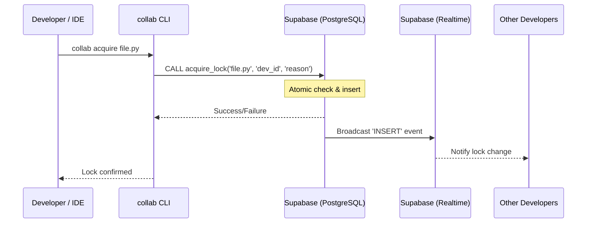

# Collab Runtime Architecture

This document describes the high-level design, component interactions, and data flow of the Collab Runtime system.

---

## System Overview

Collab Runtime is a distributed file-locking system designed for collaborative development environments. It ensures that only one developer can modify a specific file at a time, preventing merge conflicts and data loss.

### Key Components

1.  **CLI (Command Line Interface)**: The user-facing tool for manual lock operations and management.
2.  **Daemon (Watcher)**: A background process that monitors file system events and synchronizes lock state.
3.  **Supabase Backend**: Provides real-time data synchronization via PostgreSQL and Realtime (WebSockets).
4.  **VS Code Extension**: A thin client that provides UI-level integration, warnings, and status indicators.

---

## Data Flow

### 1. Lock Acquisition

### 2. Watcher Loop

The daemon runs an asynchronous loop that performs the following tasks:

- **Heartbeat**: Periodically updates its own session record to signal liveness.
- **Synchronization**: Reconciles local lock state with the remote database.
- **Event Handling**: Responds to real-time events (locks acquired/released by others).

---

## State Management

### Local State

Local state is stored in the `COLLAB_STATE_DIR` (default: `.collab/` or a temporary system directory).

- **`.daemon.pid`**: Contains the PID and session metadata of the active daemon.
- **`extension_debug.log`**: Logs specifically for the VS Code extension interactions.

### Remote State (Supabase)

- **`file_locks` table**: Stores the source of truth for all active locks.
- **`file_locks_history` table**: An audit trail of all lock lifecycle events.
- **`acquire_lock` RPC**: A PL/pgSQL function that ensures atomicity during acquisition to prevent race conditions.

### Multi-agent identity (human + agent)

Lock ownership is keyed on **`(developer_id, agent_id)`**:

| Field          | Role                                                                     |
| -------------- | ------------------------------------------------------------------------ |
| `developer_id` | Human / GitHub user (git `user.name` or `COLLAB_DEVELOPER_ID`)           |
| `agent_id`     | Stable per-agent run id (`COLLAB_AGENT_ID` or auto-generated). Internal. |
| `agent_label`  | Human task description ("why / what for"), e.g. `fix-ci-dashboard`       |
| `origin`       | Authoritative attribution: `human` or `agent`                            |
| `agent_kind`   | AI runtime family for display (`cursor`, `claude-code`, `copilot`, ...)  |

When `agent_id` is `NULL`, behavior matches the original human-only model. Two agents under the same
human conflict on acquire; a human may `force-release` any lock held under their own `developer_id`
(including other agents' locks) without an admin key.

### Strict attribution (who actually edited)

`origin` is the source of truth for the dashboard and is decided by an **explicit** signal, never by
ambient IDE environment variables:

- The **background watcher** attributes bulk git-status auto-locks to the **human** (`origin=human`,
  `agent_id=NULL`) — even when launched from a terminal that exported `CURSOR_TRACE_ID` etc. This
  applies to **both** watcher entrypoints: the `collab watch` daemon (VS Code / Cursor) and
  `python -m collab.live_locks_watcher` (PyCharm). A dedicated agent watcher can opt in with
  `COLLAB_WATCHER_AGENT_ID`.
- An **AI agent** claims the files it edits via `collab claim` (or an IDE edit hook), producing
  `origin=agent` with a unique `agent_id`.
- The `acquire_lock` RPC lets an agent claim atomically **take over** a same-developer human
  auto-lock (attribution upgrade), but a human/watcher lock can **never** take over an agent lock of
  the same developer. The watcher also skips files already held by the developer's agent and cleans
  up the developer's agent locks once the work is pushed.

The dashboard renders `origin`/`agent_kind`/`agent_label` as a friendly **"AI Agent"** badge (runtime
icon + task) for agent locks and a **"User"** chip for human locks. The raw `agent_id` is shown only
in a hover tooltip, never as the primary label.

---

## Security Model

- **Authentication**: Uses Supabase anonymous keys for general operations and service-role keys for administrative tasks (force-release).
- **Atomicity**: Guaranteed at the database level using unique constraints and stored procedures.
- **Process Isolation**: The daemon uses PID files and cross-platform process checks (`psutil`) to ensure one watcher per `(workspace, agent_id)` (or per workspace when no agent is set).

---

## Extension Integration

The VS Code extension is designed as a **thin client**. It does not contain any business logic for locking. Instead, it:

1.  Detects the installed `collab-runtime` package.
2.  Spawns the `collab` CLI for all operations.
3.  Monitors the CLI's output and logs for UI updates.
4.  Provides a bridge between the IDE and the background daemon.

Source lives under `editors/vscode/collab-locks/`. PyCharm run-configuration templates live under `editors/pycharm/`.

---

## Repository Layout (collab package)

| Path                           | Purpose                                                     |
| ------------------------------ | ----------------------------------------------------------- |
| `collab/`                      | Sole Python package: CLI, lock client, watcher, dashboard   |
| `collab/errors.py`             | Structured error taxonomy (Phase 5)                         |
| `collab/safe_subprocess.py`    | Validated git/taskkill/watcher subprocess wrapper (Phase 5) |
| `collab/platform_probe.py`     | Validated tasklist/wmic/powershell/ps probes (Phase 5.2)    |
| `scripts/git-hooks/`           | Tracked git hook templates                                  |
| `scripts/install_hooks.sh`     | Copies templates into `.git/hooks`                          |
| `supabase/schema.sql`          | Supabase schema for consumer projects                       |
| `docs/pypi/README.md`          | PyPI package readme                                         |
| `editors/vscode/collab-locks/` | VS Code / Cursor extension                                  |
| `editors/pycharm/`             | IDE run-configuration template                              |
