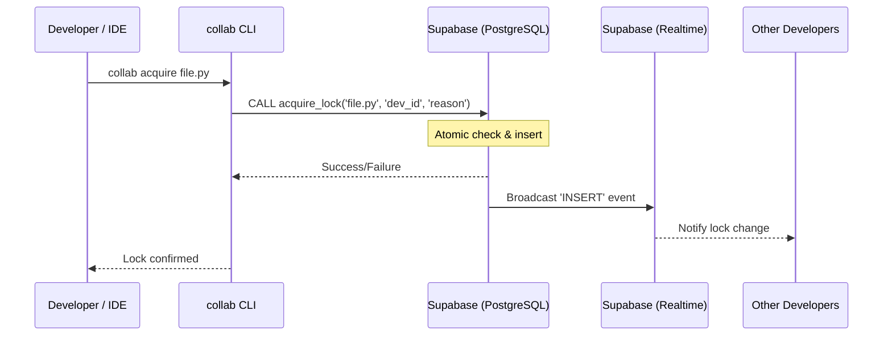

# Collab Runtime Architecture

This document describes the high-level design, component interactions, and data flow of the Collab Runtime system.

---

## System Overview

Collab Runtime is a distributed file-locking system designed for collaborative development environments. It ensures that only one developer can modify a specific file at a time, preventing merge conflicts and data loss.

### Key Components

1.  **CLI (Command Line Interface)**: The user-facing tool for manual lock operations and management.
2.  **Daemon (Watcher)**: A background process that monitors file system events and synchronizes lock state.
3.  **Supabase Backend**: Provides real-time data synchronization via PostgreSQL and Realtime (WebSockets).
4.  **VS Code Extension**: A thin client that provides UI-level integration, warnings, and status indicators.

---

## Data Flow

### 1. Lock Acquisition

### 2. Watcher Loop

The daemon runs an asynchronous loop that performs the following tasks:

- **Heartbeat**: Periodically updates its own session record to signal liveness.
- **Synchronization**: Reconciles local lock state with the remote database.
- **Event Handling**: Responds to real-time events (locks acquired/released by others).

---

## State Management

### Local State

Local state is stored in the `COLLAB_STATE_DIR` (default: `.collab/` or a temporary system directory).

- **`.daemon.pid`**: Contains the PID and session metadata of the active daemon.
- **`extension_debug.log`**: Logs specifically for the VS Code extension interactions.

### Remote State (Supabase)

- **`file_locks` table**: Stores the source of truth for all active locks.
- **`file_locks_history` table**: An audit trail of all lock lifecycle events.
- **`acquire_lock` RPC**: A PL/pgSQL function that ensures atomicity during acquisition to prevent race conditions.

### Multi-agent identity (human + agent)

Lock ownership is keyed on **`(developer_id, agent_id)`**:

| Field          | Role                                                                     |
| -------------- | ------------------------------------------------------------------------ |
| `developer_id` | Human / GitHub user (git `user.name` or `COLLAB_DEVELOPER_ID`)           |
| `agent_id`     | Stable per-agent run id (`COLLAB_AGENT_ID` or auto-generated). Internal. |
| `agent_label`  | Human task description ("why / what for"), e.g. `fix-ci-dashboard`       |
| `origin`       | Authoritative attribution: `human` or `agent`                            |
| `agent_kind`   | AI runtime family for display (`cursor`, `claude-code`, `copilot`, ...)  |

When `agent_id` is `NULL`, behavior matches the original human-only model. The same `developer_id`
may re-acquire any of their own locks, but attribution is **sticky toward the agent** (#169): an agent
claim after a human auto-lock upgrades the lock to `origin=agent`, while a human commit after an agent
edit succeeds **without** downgrading it back to `human`. A human may also `force-release` any lock held
under their own `developer_id` (including other agents' locks) without an admin key.

### Conflict Prevention and Lock Lifecycle

Collab prevents merge conflicts by ensuring only one developer can modify a file at a time.

- **Lock Acquisition**: Automatically acquired by the background watcher on local edit, or manually via CLI.
- **Lock Release**: By default, locks are released automatically after a successful `git push` (via the pre-push hook). This ensures that files are only locked while work is "in progress" locally.
- **PR-aware persistent claims (edit-time cross-PR protection, `COLLAB_PR_CLAIMS=1`, opt-in)**: extends the lock lifecycle beyond "in progress locally" to "open PR on the remote". On push, instead of releasing, the files changed on the pushed branch (vs the base) are retained as **claims** — ordinary `file_locks` rows with `is_pr_claim=true`, `claim_branch`, `claimed_at` — so the _existing_ cross-developer machinery (watcher warning + pre-commit block) protects them at **edit time** for any other developer. Implementation notes:
  - The `acquire_lock` RPC does not touch the claim columns on renewal, so an owner re-editing a claimed file does not demote the claim (sticky).
  - Retention is atomic via the `release_all_except(developer_id, keep_paths, branch)` RPC, which preserves attribution columns (`origin`/`agent_id`).
  - **Release is git-only** (no GitHub token): the client reconciler (`reconcile_pr_claims` → `overlap.stale_claim_branches`) force-prunes-fetches and releases a claim when its branch is **deleted on the remote** (primary, squash-merge-safe) or **merged** into the base. A DB-side `release_stale_claims` pg_cron (default 30 days) guarantees liberation even if the owner's daemon never runs.
  - Single-owner-per-file (PK `file_path`) ⇒ **last-writer-wins**; squash-merge relies on delete-on-merge; a closed-but-not-deleted PR falls to the expiry; the migration is manual and the runtime degrades to today's behavior if the columns/RPCs are absent.
- **Cross-Branch Overlap Detection (client)**: Collab detects when changes on the current branch would conflict with other unmerged branches (local or remote-tracking).
  - **Advisory (Default)**: Warnings are issued during `git push` but do not block the operation.
  - **Strict Mode**: When `COLLAB_OVERLAP_STRICT=1` is set, `git push` is blocked if an overlap is detected. Strict mode implies the check, so it cannot be silently disabled by `COLLAB_OVERLAP_CHECK=0`.
  - **Line-level accuracy**: a file-level overlap is confirmed with `git merge-tree` (a real in-memory 3-way merge, git >= 2.38). Edits to _different_ regions of the same file do not conflict and are not flagged; on older git it falls back to file-level. Toggle with `COLLAB_OVERLAP_LINE_LEVEL`.
  - **Remote-agnostic**: the comparison remote is resolved dynamically — the push target git passes to the pre-push hook (`$1`), then the branch upstream, then `origin`, then the sole remote. Override with `COLLAB_OVERLAP_REMOTE`. Base ref, candidate refs, and the fetch all use the resolved remote.
  - **Remote refresh**: in strict mode the pre-push hook runs `git fetch --prune <remote>` first (`COLLAB_OVERLAP_FETCH` is `auto`, i.e. strict-only, by default) so a branch pushed from another clone is visible — closing the gap where stale tracking refs hid an overlap.
  - **Fail-closed**: In strict mode, an unexpected error or an inability to refresh remote state blocks the push (`exit 1` = overlap, `exit 3` = could-not-verify). Advisory mode always fails open.
  - **False-positive guard**: branches that `HEAD` is stacked on top of (ancestors of `HEAD`) are excluded. The warning text is plain ASCII so it renders on a Windows cp1252 console without raising `UnicodeEncodeError`.
- **Cross-PR Overlap Detection (server)**: `collab.pr_overlap`, run by the `PR Overlap Guard` GitHub Action on `pull_request`, fails the check when a PR's changed files overlap another open PR targeting the same base. This is the enforcement layer that `git push --no-verify` cannot bypass; require it via branch protection. The overlap math is a pure, unit-tested function with network access isolated behind an injectable HTTP getter.

### Strict attribution (who actually edited)

`origin` is the source of truth for the dashboard and is decided by an **explicit** signal, never by
ambient IDE environment variables:

- The **background watcher** attributes bulk git-status auto-locks to the **human** (`origin=human`,
  `agent_id=NULL`) — even when launched from a terminal that exported `CURSOR_TRACE_ID` etc. This
  applies to **both** watcher entrypoints: the `collab watch` daemon (VS Code / Cursor) and
  `python -m collab.live_locks_watcher` (PyCharm). A dedicated agent watcher can opt in with
  `COLLAB_WATCHER_AGENT_ID`.
- An **AI agent** claims the files it edits via `collab claim` (or an IDE edit hook), producing
  `origin=agent` with a unique `agent_id`.
- **Sticky attribution (#169):** the `acquire_lock` RPC keeps ownership atomic and race-free. An
  agent claim **upgrades/renews** the lock to `origin=agent`; a human acquire — whether the background
  watcher **or** an explicit pre-commit/commit — **never downgrades** an existing agent lock (it keeps
  `origin`, `agent_id`, `agent_label`, `agent_kind`, and the AI-agent `reason`). The same `developer_id`
  can always renew their own lock; the only same-developer conflict is **cross-agent** (two different
  agents editing one file — the #150/#153 edit-time signal). This removes the previous dependence on
  client-side timing (`dev_other_locked`), which lost the race and mislabelled agent edits as `User`.
  A renewal also never resets `acquired_at`, so lock durations stay honest.

The dashboard renders `origin`/`agent_kind`/`agent_label` as a friendly **"AI Agent"** badge (runtime
icon + task) for agent locks and a **"User"** chip for human locks. The raw `agent_id` is shown only
in a hover tooltip, never as the primary label.

---

## Security Model

- **Authentication**: Uses Supabase anonymous keys for general operations and service-role keys for administrative tasks (force-release).
- **Atomicity**: Guaranteed at the database level using unique constraints and stored procedures.
- **Process Isolation**: The daemon uses PID files and cross-platform process checks (`psutil`) to ensure one watcher per `(workspace, agent_id)` (or per workspace when no agent is set).

---

## Extension Integration

The VS Code extension is designed as a **thin client**. It does not contain any business logic for locking. Instead, it:

1.  Detects the installed `collab-runtime` package.
2.  Spawns the `collab` CLI for all operations.
3.  Monitors the CLI's output and logs for UI updates.
4.  Provides a bridge between the IDE and the background daemon.

Source lives under `editors/vscode/collab-locks/`. PyCharm run-configuration templates live under `editors/pycharm/`.

---

## Repository Layout (collab package)

| Path                           | Purpose                                                     |
| ------------------------------ | ----------------------------------------------------------- |
| `collab/`                      | Sole Python package: CLI, lock client, watcher, dashboard   |
| `collab/errors.py`             | Structured error taxonomy (Phase 5)                         |
| `collab/safe_subprocess.py`    | Validated git/taskkill/watcher subprocess wrapper (Phase 5) |
| `collab/platform_probe.py`     | Validated tasklist/wmic/powershell/ps probes (Phase 5.2)    |
| `scripts/git-hooks/`           | Tracked git hook templates                                  |
| `scripts/install_hooks.sh`     | Copies templates into `.git/hooks`                          |
| `supabase/schema.sql`          | Supabase schema for consumer projects                       |
| `docs/pypi/README.md`          | PyPI package readme                                         |
| `editors/vscode/collab-locks/` | VS Code / Cursor extension                                  |
| `editors/pycharm/`             | IDE run-configuration template                              |

### Editable Install Auto-Repair

Collab is designed to be installed in **editable mode** (`pip install -e .`) when used from a source
checkout. This ensures the daemon serves live dashboard assets from the source tree, not a stale
`site-packages` snapshot. The following mechanisms keep the install in sync automatically:

| Mechanism                                 | Trigger                                     | Action                                                                                      |
| ----------------------------------------- | ------------------------------------------- | ------------------------------------------------------------------------------------------- |
| **`post-merge` git hook**                 | `git pull` / `git merge`                    | Re-runs `pip install -e .` when `pyproject.toml`, `setup.py`, or `requirements*.txt` change |
| **`post-checkout` git hook**              | `git checkout` / `git switch` (branch only) | Re-runs `pip install -e .` when package definition files differ between branches            |
| **`setup.ps1` / `setup.sh` health check** | Every setup run                             | Detects non-editable installs via `direct_url.json` and reinstalls as `-e .`                |
| **`daemon-start` self-check**             | `collab daemon-start`                       | Emits a clear warning if the running install is non-editable                                |

#### Hook Lifecycle (post-merge and post-checkout)

Before running `pip install -e .`, each hook performs a defensive cleanup:

1. **Stop the daemon** — releases `collab.exe` file locks on Windows.
2. **Remove stale `site-packages/collab/`** — a prior non-editable install leaves a copy that
   takes priority over `.pth`-based editable installs.
3. **Remove pip rename orphans** (`~ollab_runtime-*.dist-info/`) — left behind by interrupted
   `pip install` operations.
4. **Run `pip install -e .`** — restores editable mode.
5. **Restart the daemon** — launched in background (`&`) so the hook never blocks.

#### Health Check (Editable Detection)

The `Test-SetupCollabInstallHealthy` (PowerShell) and `setup_collab_install_healthy` (bash)
functions use `importlib.metadata` to read `direct_url.json` from the `collab-runtime` dist-info
directory. This is the canonical way to detect editable installs:

- **Editable**: `{"dir_info": {"editable": true}, "url": "file:///..."}`
- **Non-editable**: `{"dir_info": {}, "url": "file:///..."}`

This replaces the previous approach of checking `module.__file__`, which was unreliable because
`python -c` adds the current directory to `sys.path`, masking stale `site-packages` copies.

#### Orphan Cleanup in Setup Scripts

Both `setup.ps1` and `setup.sh` include explicit cleanup of stale `site-packages/collab/`
directories and `~ollab_runtime-*.dist-info` / `~collab-*.dist-info` rename orphans before
every `pip install` run. This makes `setup.ps1 -Force` a reliable recovery tool for broken
install states.
